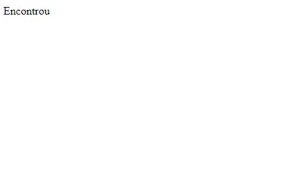

# Atividades de analise de códigos em JavaScript

    

# Índice

* [Introdução](#introdução)

* [Varíaveis](#Varíaveis)

* [Tecnologias-utilizadas](#tecnologias-utilizadas)
  
* [Sites-utilizados](#sites-utilizados)

* [Autores](#autores)

* [Detalhes](#detalhes)

# Introdução
    
O exercício proposto teve o intuito de procurarmos os significado de varíaveis e apreder suas utilidades. Os codigos de exmplo que está no arquivo "Codigo-de-exercicio (1).html" cria um temporizador de 10 minutos e o outro "Codigo-de-exercicio (2).html" tem um sitema de verdadeiro e falso para encomtrar o documento. Abaixo estará listado suas varíaveis.

# Varíaveis

    - Function: Indica uma função pré determinada.

    - var: Representa uma váriavel.

    - Date: Cria um campo para que o usuário possa selecionar uma data.

    - Document: É o objeto raiz do projeto, representa o própio documento HTML.
    
    - GetElementById: Retorna o elemento cujo atributo Id foi especificado.

    - InnerHTML: o HTML interno de alogo, sendo esse último um objeto, ou seja, uma tag.
    
    - if: Significa "se" e é como usamos os operadores lógicos de uma linguagem. Ele condiciona um qualquer, executando-o apenas se ela for verdadeira.

    - }: linguagem de criação de scripts ou uma linguagem interpretada.

    - return: É usada em uma função para especificar o valor que a função deve fornecer de volta quando é chamada. 
    
# Tecnologias-utilizadas

    HTML5 e Github

# Sites utilizados

   * [Terminal root](https://terminalroot.com.br/2016/12/alguns-codigos-simples-de-javascript-2.html)

# Autores

    - Sarah lorena
    - Rebeca Amanda

# Detalhes

    Iniciada: 13/03/2024 Terminada: ?
